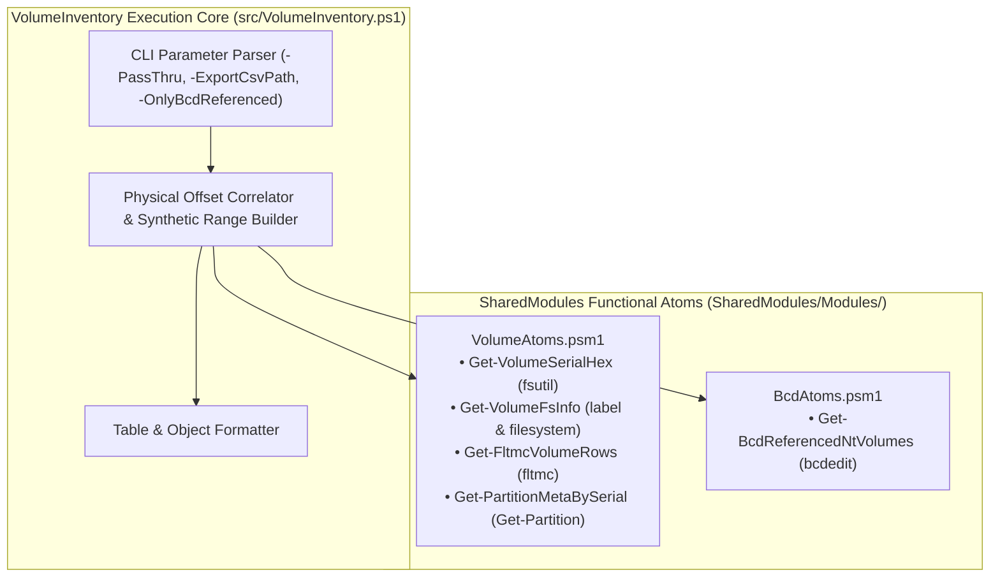

# VolumeInventory: Architecture Document

Module: docs/Architecture.md  
Authors: Rolf, VolumeInventory Architecture Team  
Version: 2.5.0  
Status: Authoritative Architecture  
Date: 2026-08-16  

---

## 1. High-Level Architecture & Shared Atoms Integration

`VolumeInventory` correlates low-level volume filters, partition metadata, and BCD references into a unified physical inventory, leveraging shared functional atoms from [`SharedModules`](file:///D:/Git_Repositories/SharedModules):

---

## 2. Correlation Pipeline

1. **Filter-Manager Device Resolution**: Invokes `Get-FltmcVolumeRows` (`VolumeAtoms.psm1`) to parse `\Device\HarddiskVolumeN` device names and DOS drive letters.
2. **Partition & Serial Correlation**: Invokes `Get-PartitionMetaBySerial` (`VolumeAtoms.psm1`) to correlate volume serial numbers with physical disk numbers, partition numbers, start offsets, and GPT/MBR types.
3. **BCD Reference Resolution**: Invokes `Get-BcdReferencedNtVolumes` (`BcdAtoms.psm1`) to mark active boot configuration references (`InBCD` column).
4. **Physical Disk Ordering**: Sorts partitions and synthetic unallocated space strictly by physical start offset on each disk drive.
